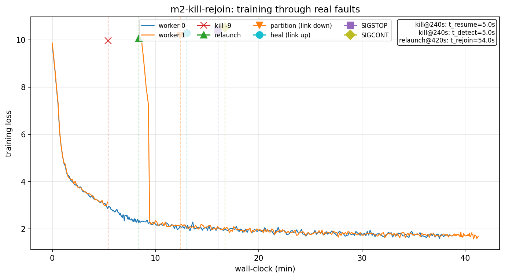
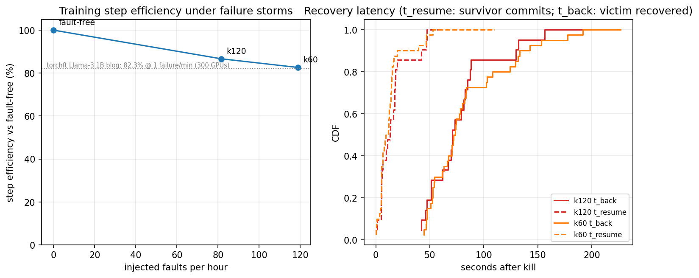
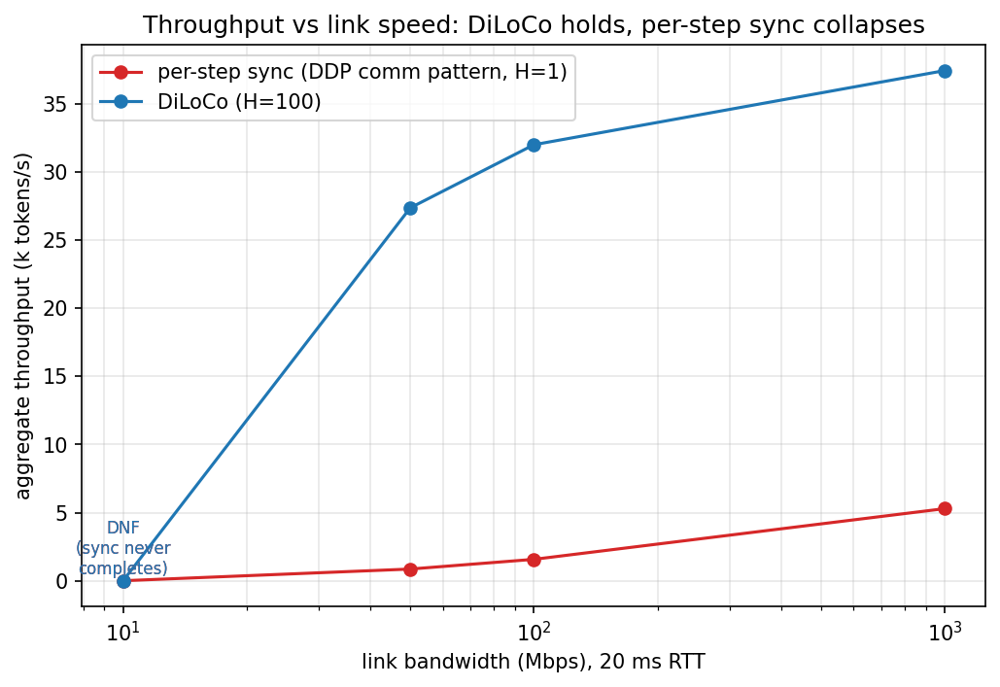

# ft-diloco

**Fault-tolerant DiLoCo: resilient low-bandwidth LLM training on commodity hardware.**

Train a small LM across cheap, unreliable machines that sync only every H steps
(DiLoCo: inner AdamW, outer Nesterov SGD over pseudo-gradients, via
[torchft](https://github.com/meta-pytorch/torchft)) — and show that killing,
disconnecting, or adding machines mid-run does not break convergence.

> Status: M0–M3 complete. WAN realism + cloud hybrid (M4) next. Full polish at M5.


*Live, unedited: two DiLoCo workers training a 51M-param LM; `kill -9` lands mid-run —
the survivor keeps committing solo; the replacement worker P2P-recovers the full state
(params + outer momentum) from its peer and rejoins at the cluster's loss. Recorded with
`scripts/record_gif.sh` — fully reproducible.*

## Results so far

**Fault tolerance works (M0.5 + M2):** `kill -9` a worker mid-training and the survivor
commits its next sync solo **5.0s** later; the relaunched worker P2P-recovers and commits
within **54s** end-to-end (mostly process/CUDA startup). Recovery restores model params
**and outer Nesterov momentum bit-exactly** (84/84 sha256 digest matches at every
post-rejoin sync boundary, GPU model). A 6-fault scenario (kill, relaunch, partition,
heal, SIGSTOP straggler, resume) finishes within **+0.6%** of the fault-free loss:



Details: [docs/findings-171.md](docs/findings-171.md).

**Failure storms (M3):** Poisson-scheduled chaos (kill -9, SIGSTOP stragglers, link
partitions) with supervisor auto-restart, ~45 min each, zero manual intervention:

| storm | executed faults | step efficiency | survivor commits after kill | victim fully back |
|---|---|---|---|---|
| k120 | 52 (69/hr) | **88.2%** | median 14s | median 73s |
| k60 | 64 (85/hr) | **85.0%** | median 12s, p90 20s | median 86s, p90 182s |

Both sit above torchft's published 82.3% step efficiency (Llama-3 1B, one failure/min,
300 L40S GPUs) at comparable-or-higher fault rates — on two consumer replicas.




**Negative result worth knowing (found the hard way):** live P2P recovery alone is NOT
sufficient under restart churn at small replica counts. A kill landing while the only
other member is alive-but-unhealed leaves a fresh-init worker as a singleton quorum —
its random weights silently become the cluster state (we observed heals from donors at
manager step 0, and the global eval regressing 2.4 → 4.0 mid-storm). torchft's 30-group
setup makes this practically unreachable; few-big-member cross-DC DiLoCo (#171's regime)
hits it head-on. Fix shipped here: **commit-coupled checkpoints** (each replica persists
state every 5 commits; restarts init from the newest checkpoint) plus a healthy-donor
invariant in the chaos harness. The no-checkpoint storm data is preserved in
`experiments/m3-storm-k*-nockpt/`.

**WAN realism (M4, home-lab leg):** netem sweep at 20 ms RTT, fp32 204.8 MB sync payload:

| link | per-step sync (DDP pattern) | DiLoCo H=100 |
|---|---|---|
| 1 Gbps | 5.3k tok/s | **37.4k tok/s** |
| 100 Mbps | 1.6k | **32.0k** |
| 50 Mbps | 0.9k | **27.4k** |
| 10 Mbps | DNF | DNF (as configured) |

Even at gigabit, syncing every step is 7× slower than DiLoCo on the same link; DiLoCo
stays flat down to 50 Mbps. At 10 Mbps the ~200 s allreduce **starves torchft's own
control plane** (heartbeats share the link → quorum timeout → cascade) — quantized or
streamed syncs are the documented fix direction. Plus a real two-physical-machine run
(RTX 3060 box + CPU-only box over house ethernet): 4/4 cross-machine commits with
**bit-identical digests on heterogeneous hardware**, and a rendezvous lesson: torchft's
separate `quorum_timeout` (default 60 s) must exceed the first-sync skew of
heterogeneous workers.



**DiLoCo trades sync frequency for quality smoothly (M1):** 2 workers, 51M params,
TinyStories, equal total tokens vs a 3-seed single-GPU baseline (eval loss 1.6773 ± 0.0011):

| sync every H steps | 25 | 50 | 100 | 200 | 500 |
|---|---|---|---|---|---|
| eval loss | 1.724 | 1.756 | 1.783 | 1.801 | 1.836 |
| Δ loss vs baseline | +2.8% | +4.7% | +6.3% | +7.4% | +9.4% |
| comm volume vs per-step DP | 25× less | 50× | 100× | 200× | 500× |

Measured wire bytes (veth counters) match the analytic payload within +2…8% for H ≤ 100;
the residual is a ~constant ~0.5 GB/run control-plane floor (lighthouse heartbeats +
quorum), which dominates only when payload shrinks at H = 500. Single seed per H so far;
outer lr fixed at 0.7 across H (untuned — known to favor small H).


## Layout

- `src/ftdiloco/` — model (nanoGPT-class), data (uint16 memmap shards), train loop,
  torchft integration (`train.py` + `ft.py` are the only torchft touchpoints), JSONL metrics
- `chaos/` — fault-injection controller (kill / partition / throttle / late-join)
- `scripts/` — lighthouse/worker launchers, netns fake-WAN, run recipes
- `analysis/` — log fusion + plots
- `configs/` — model / train / chaos / netem YAML
- `experiments/<run_id>/` — committed JSONL + plots per run
- `docs/` — architecture, runbook, torchft findings (issue #171 evidence)

## Quickstart (dev)

```bash
uv venv && uv pip install -e '.[dev]'
make lint test
# data prep + training run on the GPU host:
python -m ftdiloco.data --dataset tinystories --out data/tinystories
python -m ftdiloco.train --config configs/train/m0_tiny.yaml
python analysis/plot_convergence.py --runs experiments/m0-tiny-* --out plots/m0.png
```

## Hardware

| Node | Role | Spec |
|---|---|---|
| worker4 | GPU trainer | Ryzen 9 5950X, RTX 3060 12GB, Gen4 NVMe |
| worker1 | Lighthouse / CPU worker | 8-core, 16GB |
| link | deliberately commodity | gigabit ethernet + tc/netem WAN simulation |

torchft is installed editable from a pinned fork checkout on the training hosts
(commit recorded in `pyproject.toml`); it is not a pip dependency of this package.
